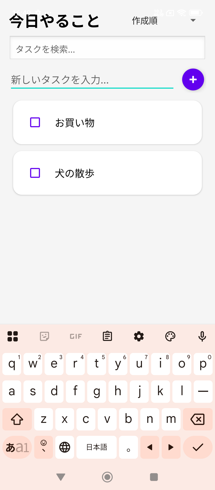
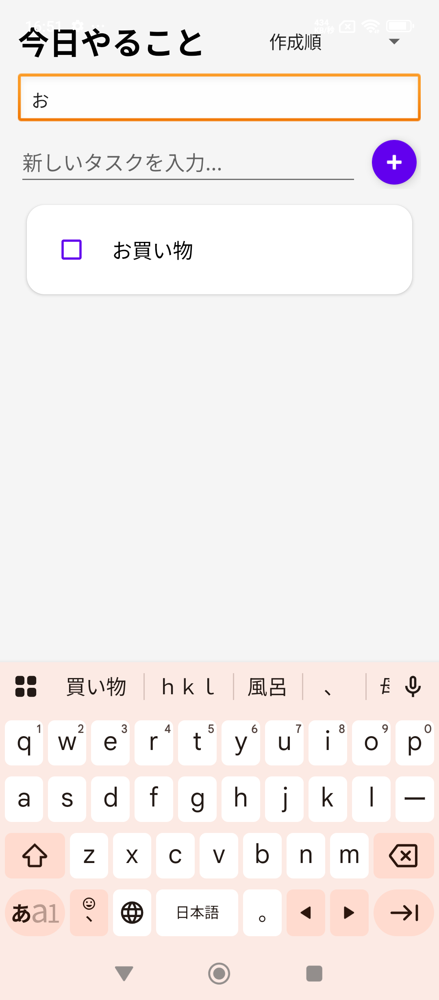

# TodayMemo 📝

  
  

Androidアプリ開発の基礎から最新のベストプラクティスまでを習得するために開発した、シンプルでモダンなToDoアプリです。

## 📱 アプリ概要
「今日やるべきこと」を迷わず管理できるタスク管理アプリです。直感的な操作性と、アプリを閉じてもデータが消えない本格的なデータベース機能を備えています。

## ✨ 主な機能
- **タスク追加**: FAB（浮遊アクションボタン）から素早くタスクを登録。
- **完了チェック**: ワンタップでタスクの完了/未完了を切り替え。完了タスクには打消し線を表示。
- **リアルタイム検索**: タスク名を入力するだけで、瞬時にリストを絞り込み。
- **高度な並び替え**: 作成順、名前順、完了状態順にリストを一括ソート。
- **データの永続化**: Room Databaseにより、スマホ内に安全にデータを保存。
- **削除確認**: 長押しによる削除ダイアログで、誤操作を防止。

## 🛠 使用技術 (Tech Stack)
モダンなAndroid開発で標準的に使われるライブラリとアーキテクチャを採用しています。

- **言語**: Kotlin
- **アーキテクチャ**: MVVM (Model-View-ViewModel) + Repository Pattern
- **UI コンポーネント**:
  - RecyclerView (高効率なリスト表示)
  - MaterialCardView (モダンなカードデザイン)
  - Floating Action Button (FAB)
  - ConstraintLayout (レスポンシブな配置)
- **データベース**: Room Database (SQLiteのラッパー)
- **非同期処理**: Kotlin Coroutines
- **データ監視**: LiveData (リアクティブなUI更新)

## 🎯 学習目的
このプロジェクトは、以下の技術を体系的に学ぶことを目的として開発されました。
1. **View-based UI**: XMLレイアウトとViewの連携。
2. **データの扱い**: メモリ(ArrayList) ➔ ファイル(SharedPreferences) ➔ データベース(Room) へのステップアップ。
3. **設計思想**: 密結合なコードから、MVVMによる役割分担された疎結合な設計へのリファクタリング。
4. **UXの追求**: キーボードによる遮蔽対策や、リアルタイムフィードバックの実装。

## 🗓 開発期間
**Day 1 〜 Day 14 (計2週間)**
初心者からスタートし、段階的に機能を拡張しながら現在の構成を構築しました。

## 🚀 今後の改善案
- [ ] タスクの期限設定（DatePicker）と通知機能
- [ ] タスクのカテゴリ分け（仕事、個人、買い物など）
- [ ] ダークモードへの完全対応
- [ ] データのバックアップ/復元機能（CSV出力など）

## 📄 ライセンス
このプロジェクトは学習用として公開されています。自由にご活用ください。
